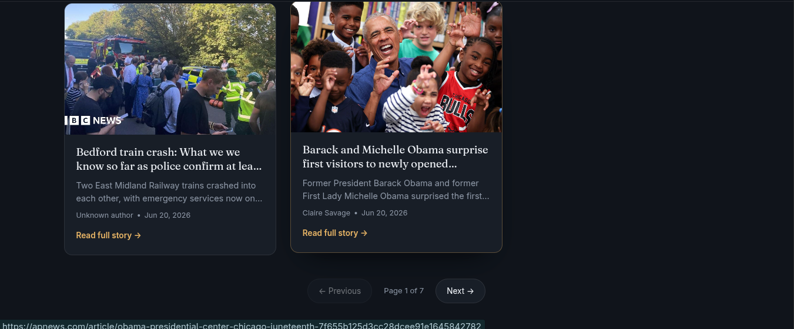

# 📰 NewsMonkey

NewsMonkey is a modern React-based news application that delivers the latest headlines across multiple categories including Business, Entertainment, Health, Science, Sports, Technology, and General News.

The application uses a secure serverless API proxy deployed on Vercel to fetch news from NewsAPI while keeping API keys hidden from the client-side.

## 🚀 Live Demo

* Frontend: https://mubeenbhatti563.github.io/React_Monkey_News/
* API Proxy: https://react-monkey-news.vercel.app/api/news

## ✨ Features

* Browse latest news headlines
* Multiple news categories
* Responsive mobile-first design
* Featured headline section
* Loading skeleton animations
* Pagination support
* Secure API key handling via Vercel
* Modern dark UI
* React Router navigation

## 🛠️ Technologies Used

### Frontend

* React.js
* React Router DOM
* CSS3
* Bootstrap 5
* React Top Loading Bar

### Backend

* Vercel Serverless Functions
* NewsAPI

## 📂 Project Structure

```
React_Monkey_News/
│
├── api/
│   └── news.js
│
├── public/
│   ├── favicon.ico
│   ├── monkey_news_icon.png
│   ├── manifest.json
│   └── index.html
│
├── src/
│   ├── Components/
│   │   ├── Navbar.js
│   │   ├── NewsComponents.js
│   │   ├── NewsItems.js
│   │   ├── Footer.js
│   │   └── Spinner.js
│   │
│   ├── App.js
│   ├── App.css
│   ├── index.js
│   └── index.css
│
├── package.json
├── vercel.json
└── README.md
```

## ⚙️ Installation

Clone the repository:

```bash
git clone https://github.com/MubeenBhatti563/React_Monkey_News.git
```

Move into the project directory:

```bash
cd React_Monkey_News
```

Install dependencies:

```bash
npm install
```

Start development server:

```bash
npm start
```

## 🔐 Environment Variables

Create a `.env.local` file:

```env
React_App_NewsMonkey=YOUR_NEWSAPI_KEY
```

For production deployment on Vercel, add the same variable in:

Project Settings → Environment Variables

## 🚀 Deployment

### Frontend (GitHub Pages)

```bash
npm run deploy
```

### Backend (Vercel)

Push changes to GitHub:

```bash
git add .
git commit -m "Update API"
git push origin main
```

Vercel automatically redeploys the serverless API.

## 📸 Screenshots

### Home Page


### Pagination



### Science


## 📈 Future Improvements

* Search functionality
* Infinite scrolling
* Bookmark articles
* User authentication
* Personalized news feed
* Dark/Light theme switcher
* News filtering by source

## 👨‍💻 Author

Muhammad Mubeen

Software Engineering Student

GitHub: https://github.com/MubeenBhatti563

## 📄 License

This project is created for educational and portfolio purposes.
